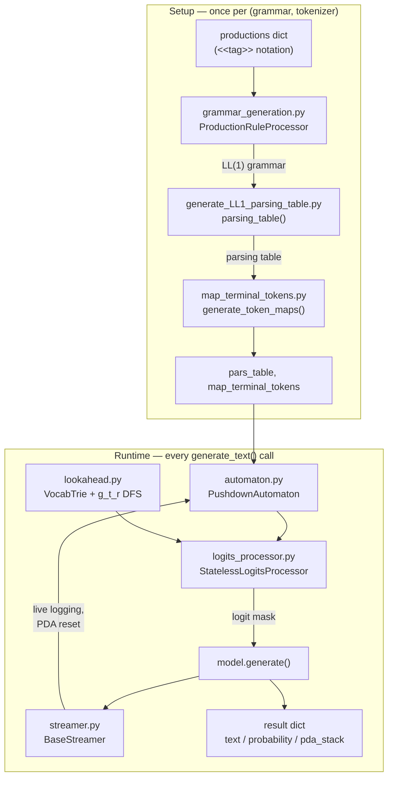

# Architecture

GrammarLLM's pipeline splits into a one-time **setup phase** (grammar → parsing table → PDA) and a **runtime phase** (logits masking during `model.generate()`). See [`generate_with_constraints.py`](https://github.com/misaelmongiovi/grammarllm/blob/main/grammarllm/generate_with_constraints.py) for the public entry points.



## Setup phase

| Module | Role |
|---|---|
| [`scripts/grammar_generation.py`](https://github.com/misaelmongiovi/grammarllm/blob/main/grammarllm/scripts/grammar_generation.py) | `ProductionRuleProcessor` converts the user's `<<tag>>` productions into a formal LL(1) grammar: tokenizes exact-string terminals, groups shared subword prefixes, left-factorizes alternatives. |
| [`scripts/generate_LL1_parsing_table.py`](https://github.com/misaelmongiovi/grammarllm/blob/main/grammarllm/scripts/generate_LL1_parsing_table.py) | Computes FIRST/FOLLOW sets (fixed-point) and builds the LL(1) parsing table. Raises `Conflict:` errors for non-LL(1) grammars. |
| [`scripts/map_terminal_tokens.py`](https://github.com/misaelmongiovi/grammarllm/blob/main/grammarllm/scripts/map_terminal_tokens.py) | Bridges the abstract grammar and the concrete tokenizer: maps each terminal (exact string or regex) to the vocabulary token IDs that satisfy it. |

Setup is the expensive part and depends only on the grammar and tokenizer — the [usage guide](usage.md#pipeline-overview) recommends computing it once and reusing it across generations.

## Runtime phase

| Module | Role |
|---|---|
| [`modules/automaton.py`](https://github.com/misaelmongiovi/grammarllm/blob/main/grammarllm/modules/automaton.py) | The deterministic `PushdownAutomaton` (PDA) — the central engine. State is `(stack, residue)`; it's stateless/cloneable per beam, so beam reordering by Hugging Face can't corrupt parser state. |
| [`modules/logits_processor.py`](https://github.com/misaelmongiovi/grammarllm/blob/main/grammarllm/modules/logits_processor.py) | `StatelessLogitsProcessor` — a Hugging Face `LogitsProcessor` that re-simulates the PDA from token history at each step (LRU-cached) and masks invalid-token logits to `-inf`. |
| [`modules/lookahead.py`](https://github.com/misaelmongiovi/grammarllm/blob/main/grammarllm/modules/lookahead.py) | Token-boundary lookahead (`g_t_r`): a vocab trie plus DFS over PDA fragment transitions, so masks include merged tokens that span grammar-terminal boundaries. On by default — see [token-boundary-lookahead.md](token-boundary-lookahead.md). |
| [`modules/streamer.py`](https://github.com/misaelmongiovi/grammarllm/blob/main/grammarllm/modules/streamer.py) | A `BaseStreamer` implementation: logs each token as it's produced and resets the PDAs when a generation run ends. Active only for `num_beams == 1` (HF doesn't support streamers with beam search). |

## Utilities

| Module | Role |
|---|---|
| [`utils/toolbox.py`](https://github.com/misaelmongiovi/grammarllm/blob/main/grammarllm/utils/toolbox.py) | `create_prompt` / `chat_template` — build chat-formatted prompts from a system prompt and few-shot examples. |
| [`utils/common_regex.py`](https://github.com/misaelmongiovi/grammarllm/blob/main/grammarllm/utils/common_regex.py) | Ready-made `regex_dict` entries (letters, numbers, decimals, identifiers, ...) for open terminal classes. |
| [`utils/pydantic_to_grammar.py`](https://github.com/misaelmongiovi/grammarllm/blob/main/grammarllm/utils/pydantic_to_grammar.py) | `pydantic_to_productions(Model)` — converts a Pydantic v2 `BaseModel` (via its JSON Schema) into a `<<tag>>` productions dict plus regex terminals, so generation is guaranteed strict, round-trippable JSON. |
| [`utils/generation_analysis.py`](https://github.com/misaelmongiovi/grammarllm/blob/main/grammarllm/utils/generation_analysis.py) | `compute_generation_analysis` / `plot_generation_analysis` — quantifies how much the grammar constrained the model at each step (preserved probability mass, entropy) from `output_scores=True` results. |
| [`utils/score_utils.py`](https://github.com/misaelmongiovi/grammarllm/blob/main/grammarllm/utils/score_utils.py) | Helpers for inspecting per-token probabilities in a `generate_text` result. |

## Public API surface

Everything above is orchestrated by `grammarllm/generate_with_constraints.py` and re-exported from the package root ([`grammarllm/__init__.py`](https://github.com/misaelmongiovi/grammarllm/blob/main/grammarllm/__init__.py)):

```python
from grammarllm import (
    get_parsing_table_and_map_tt,   # setup phase
    generate_grammar_parameters,    # builds PDA + streamer
    generate_text,                  # runtime generation
    setup_logging,
    create_prompt, chat_template,
    regex_dict,
)
```
