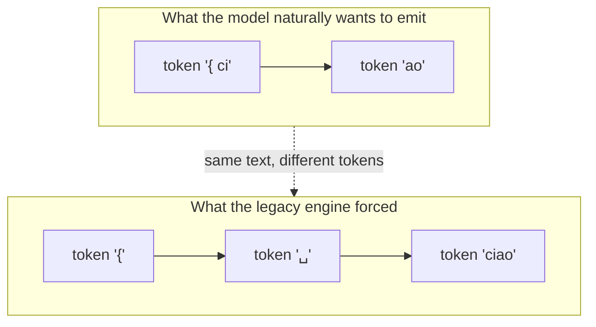
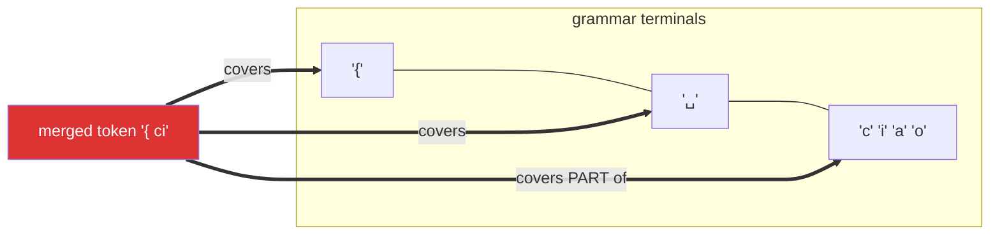
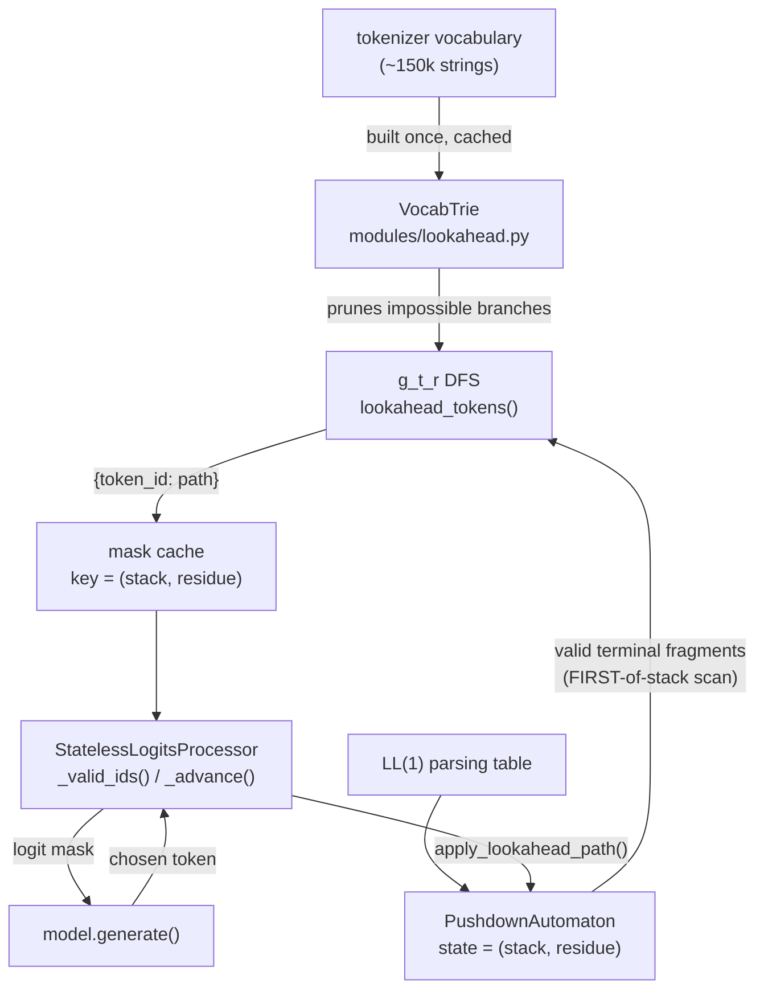
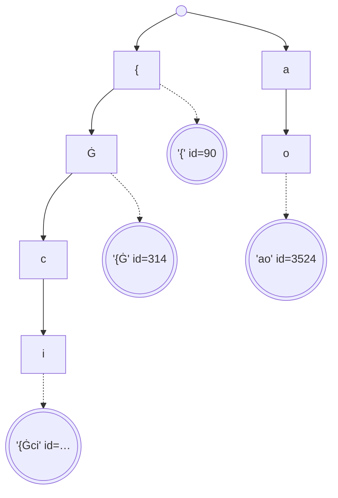
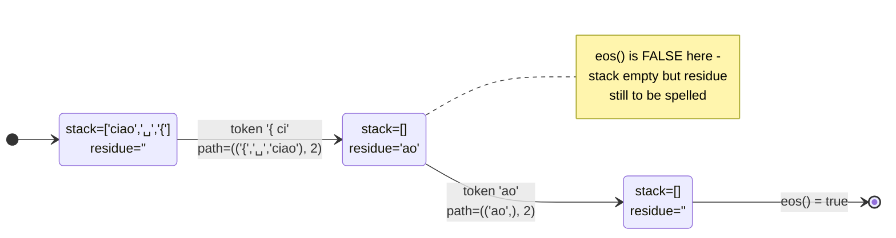
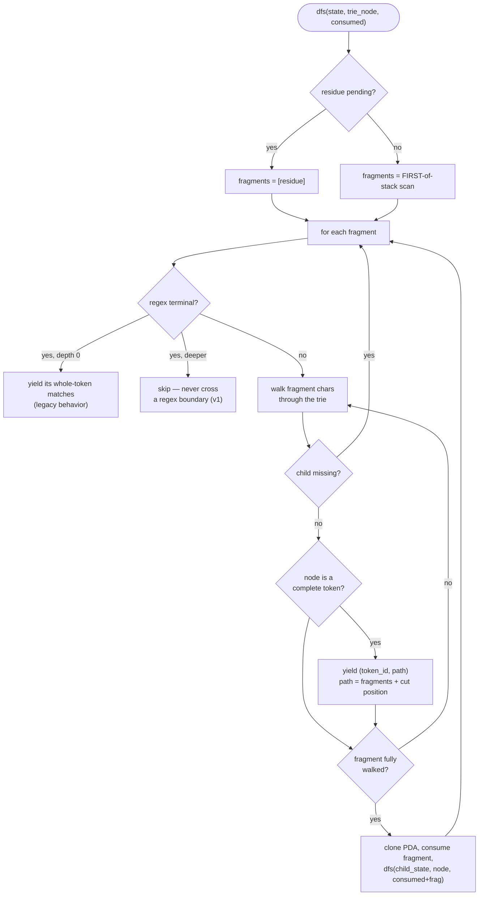
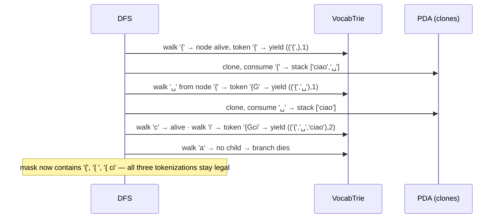
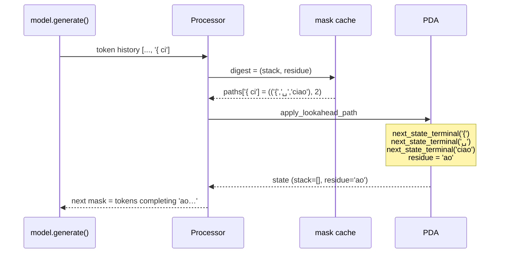
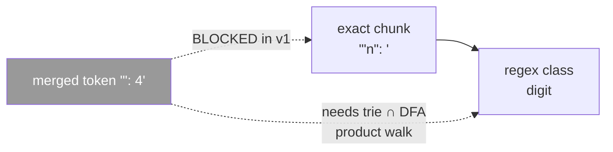

# Token-Boundary Lookahead (g_t_r) — How It Works

GrammarLLM's masks used to require every vocabulary token to fit *entirely inside one grammar terminal*. This page shows, visually, how the lookahead engine removes that limit so the model can emit its **natural merged tokens** — spanning several terminals, or stopping mid-terminal.

Measured effect (Qwen2.5-0.5B, same grammar and prompt): mean preserved probability mass **0.065 → 0.160 (+0.095, ~2.5×)**.

- Spec: [`superpowers/specs/2026-07-08-token-boundary-lookahead-design.md`](superpowers/specs/2026-07-08-token-boundary-lookahead-design.md)
- Deferred regex crossing: [`superpowers/specs/2026-07-08-regex-lookahead-future-work.md`](superpowers/specs/2026-07-08-regex-lookahead-future-work.md)

---

## 1. The problem

Grammar terminals: `{` · `␣` (space) · `ciao`. The model's tokenizer, however, likes to merge characters across those boundaries:



Both spell `{ ciao` — but the bottom sequence is **not** how the model was trained to write it. Forcing it pushes generation off the model's natural distribution: correct text, distorted probabilities.



The merged token crosses two boundaries **and** ends in the middle of `ciao`. The legacy engine could never offer it. The lookahead engine can — and remembers the leftover `ao`.

---

## 2. The components



Two swappable primitives, everything else untouched: *"what is valid here"* (`_valid_ids`) and *"consume this token"* (`_advance`). `token_lookahead=False` routes both back to the legacy engine (the A/B baseline).

---

## 3. The vocabulary trie

One character-trie over all raw vocab strings (surface alphabet: `Ġ` = space, `Ċ` = newline). Double-circled nodes mark a complete vocabulary token.



Purpose: while the DFS concatenates grammar fragments character by character, the trie answers two questions in O(1) per char — *"can any vocab token continue this way?"* (child exists) and *"is this prefix itself a complete token?"* (node has `token_id`). Every branch the vocabulary cannot realize dies at the first missing child.

---

## 4. PDA state: `(stack, residue)`

The residue is the unconsumed suffix of a partially-covered terminal. A terminal is popped from the stack the moment a token *enters* it; the unspelled characters wait in `residue`.



`eos()` = stack empty **and** residue empty. Clones and the processor's history cache carry the residue automatically.

---

## 5. The g_t_r DFS

At each PDA state, valid fragments come from the FIRST-of-stack scan (or the residue, if one is pending). The DFS walks each fragment's characters through the trie, **yields** whenever it lands on a complete token, and **recurses** into the next PDA state when a fragment survives whole:



Worked example — state `stack=['ciao','␣','{']`, walking toward `'{ ci'`:



Key invariant: **old ⊆ new** — depth-0 exact matches reproduce the legacy mask exactly; lookahead only widens it.

---

## 6. Advancing after the model picks a token

The mask stores a replay `path` per token, so consuming a merged token is deterministic — no re-search:



Tokens absent from the mask still raise `ValueError` — the no-silent-bypass invariant is unchanged, as are the dead-end fallback and forced-EOS replay.

---

## 7. What v1 does NOT cross: regex terminals



Open classes (`digit`, `json_char`) participate as whole tokens at depth 0 — exactly the pre-lookahead behavior. Crossing them requires walking the trie against the regex's character DFA in lockstep; the full design (residue as a DFA state, longest-match policy, `interegular`/hand-rolled Thompson options) lives in the [future-work doc](superpowers/specs/2026-07-08-regex-lookahead-future-work.md).

---

## 8. Using and measuring it

```python
# ON by default:
pdas, streamer = generate_grammar_parameters(tokenizer, pars_table, map_tt)

# A/B baseline (legacy boundary-strict engine):
pdas_old, streamer_old = generate_grammar_parameters(
    tokenizer, pars_table, map_tt, token_lookahead=False)

# Quantify the difference on your own grammar/prompt:
a_new = compute_generation_analysis(result_new, tokenizer, label="lookahead")
a_old = compute_generation_analysis(result_old, tokenizer, label="legacy")
compare_analyses([a_old, a_new], metric="preserved_mass")
```

The headline acceptance criterion, verified in the test suite: the tokenizer's **canonical encoding** of any valid sentence replays through the lookahead masks token-by-token — the legacy engine provably rejects it.
